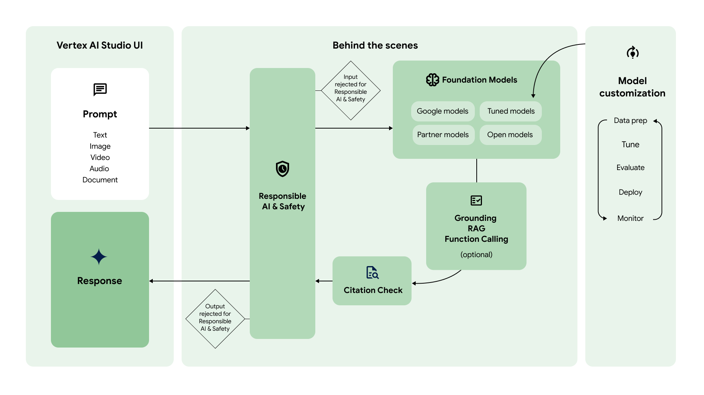

# Overview of Generative AI on Vertex AI

- Generative AI on Vertex AI gives you access to Gemini models and other lanrge generative AI models so you can evaluate, tuen, and deploy them for use in your AI-powered applications.

- This page gives you an overview of the generative AI workflow on Vertex AI, the available APIs and models, including Vertex AI API for Gemini, and directs you to resources for getting started.

## Generative AI Workflow in Vertex AI

- The following diagram shows a high level overview of the generative AI workflow.

### Prompt

- A prompt is a request sent to a generative AI model to elicit a response back.

- Depending on the model, a prompt can contain *text*, *images*, *videos*, *audio*, *documents*, and other modalities or even multiple modalities (multimodal).

- Vertex AI Studio offers a prompt management tool to help you manage your prompts.

### foundation models

- Vertex AI has a variety of generative AI foundation models that are accessible through a managed API, including the following:

    - Gemini API: Advanced reasoning, multiturn chat, code generation, and multimodal prompts.

    - Imagen API: Image generation, image editing, and visual captioning.

    - MedLM: Medical question answering and summarization. (Private GA)

- The models differ in size, modality, and cost.

### Model customization

- You can customize the default behavior of Google's foundation models so that they consistently generate the desired results without using complex prompts.

- This customization process is called model tuning.

- Model tuning helps you reduce the cost and latency of your requests by allowing you to simplify your prompts.

- Vertex AI also offers model evaluation tools to help you evaluate the performance of your tuned model.

- After you tuned model is production-ready, you can deploy it to an endpoint and monitor performance like in standard MLOps workflows.

### Request augmentation

- Vertex AI offers multiple request augmentation methods that give the model access to external APIs and real-time information.

- Gounding: Connects model responses to a source of truth, such as your own data or web search, helping to reduce hallucinations.

- RAG: Connects models to external knowledge sources, such as documents and databases, to generate more accurate and informative responses.

- Function calling: Lets the model interact with external APIs to get real-time information and perform real-world tasks.

### Citation check

- After the response is generated, Vertex AI checks whether citations need to be included with the response.

- If a significant amount of the text in the response comes from a particular source, that source is added to the citation metadata in the response.

### Response

- If the prompt and response passes the safety filter checks, the response is returned.

- Typically, the response is returned all at once.

- However, with Vertex AI you can also receive responses progressibely as it generates by enabling streaming.

## Generative AI APIs and models

### Gemini API offerings

- The Vertex AI Gemini API contains the publisher endpoints for the Gemini models developed by Google DeepMind.

- Gemini 1.5 Flash is a multimodal model you can use to create text generation and chat applications.

    - You can include text, images, audio, video, and PDF files in your prompt requests and it has the same context window as Gemini 1.5 Pro to process large amounts of multimodal data.

    - Gemini 1.5 Flash is smaller and faster than Gemini 1.5 Pro which makes it a good option to create chat assistants and on-demand content generation applications.

|Gemini model|Modalities|Context window|
|-|-|-|
|Gemini 1.5 Flash|- Text, code, images, audio, video, and PDF. - Up to 3,000 images. -Audio up to 8.4 hours. - Video without audio up to 1 hour. Video with audio up to 50 minutes.|- 1M tokens in - 8,192 tokens out|

### Other Generative AI offerings

- Text embedding generates vector embeddings for input text.

    - You can use embeddings for tasks like semantic search, recommendation, classification, and outlier detection.

## Vertex AI Studio console experiences

- When using Vertex AI Studio with the free trial or without signing in to Google Cloud, some features are not available.

| |Use without a Google Cloud account|Use with a Google Cloud free trial account|Use with an existing Google Cloud account|
|-|-|-|-|
|Sign in required|No|Yes|Yes|
|Queries per minute (QPM)|2 QPM|N/A|N/A|
|Credits offered|$0|Up to $300 for 90 days|$0|
|Prompt gallery|No|Yes|Yes|
|Prompt designer|Yes|Yes|Yes|
|Save prompts|No|Yes|Yes|
|Prompt history|No|Yes|Yes|
|Advanced parameters|No|No|Yes|
|Tuning|No|No|Yes|
|API usage|No|Yes|Yes|
|Billing required|No|No|Yes|
